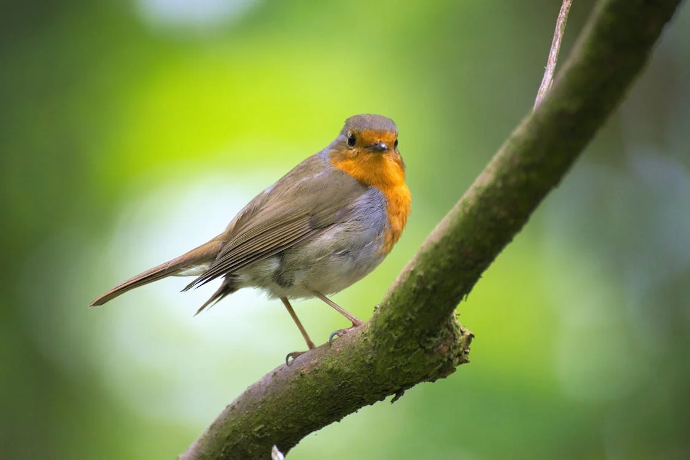

# Images in Markdown (.md)

This page demonstrates how Astro's Markdown processor automatically handles different types of image paths. Standard Markdown syntax works seamlessly with Astro's optimization features.

<div class="intro">
💡 <strong>Key Feature:</strong> Astro automatically processes images referenced in Markdown files. Images from <code>src/assets</code> get optimized, while images from <code>public/</code> are served as-is.
</div>

## Local Images (src/assets) ✨ Optimized

For images in `src/assets/`, use a relative path from the Markdown file. Astro will automatically process and optimize these during the build process.



<div class="note success">
✅ <strong>Automatically optimized:</strong> This image is processed by Astro's image service, converted to modern formats, and optimized for performance.
</div>

```markdown

```

## Public Images 📁 Unprocessed

For images in `public/`, use a path relative to the `public` folder (starting with `/`). These are **not** optimized by Astro and are served exactly as they exist in the `public` directory.


<div class="note warning">
❌ <strong>No optimization:</strong> Images from the public directory are served as-is without any processing, optimization, or format conversion.
</div>

```markdown

```

## Remote Images 🌐 Authorized vs Unauthorized

For remote images, use the full URL. Whether they get optimized depends on your `astro.config.mjs` configuration.

### Authorized Domain (Optimized)


<div class="note success">
✅ <strong>Optimized:</strong> This image's domain (images.unsplash.com) is authorized in <code>astro.config.mjs</code>, so it gets optimized.
</div>

### Unauthorized Domain (Not Optimized)


<div class="note warning">
❌ <strong>Not optimized:</strong> This domain is not authorized, so the image is served as-is for security reasons.
</div>

## Obsidian-Style Assets 🗂️ External Content

This simulates content pulled from an external tool like Obsidian, where assets are typically stored in the `public` directory.


<div class="note info">
ℹ️ <strong>External workflow:</strong> When migrating content from tools like Obsidian, assets are often placed in <code>public/</code> to maintain existing relative paths.
</div>

## Key Takeaways

1. **src/assets images** → Automatically optimized ✨
2. **public/ images** → Served as-is, no optimization 📁
3. **Remote authorized** → Optimized if domain is configured 🔐
4. **Remote unauthorized** → Not processed for security 🛡️
5. **Markdown syntax** → Works seamlessly with Astro's processing 📝

<div class="tip">
💡 <strong>Pro Tip:</strong> For maximum control over image optimization, consider using MDX instead of plain Markdown. This allows you to use Astro's Image and Picture components directly in your content.
</div>

<style>
.intro {
  background-color: #dbeafe;
  border: 1px solid #93c5fd;
  border-radius: 8px;
  padding: 1rem;
  margin: 1rem 0 2rem 0;
  color: #1e40af;
}

.note {
  font-size: 0.875rem;
  margin: 1rem 0;
  padding: 0.75rem;
  border-radius: 6px;
  font-weight: 500;
}

.note.success {
  background-color: #dcfce7;
  color: #166534;
  border-left: 4px solid #22c55e;
}

.note.warning {
  background-color: #fef2f2;
  color: #dc2626;
  border-left: 4px solid #ef4444;
}

.note.info {
  background-color: #f0f9ff;
  color: #0c4a6e;
  border-left: 4px solid #3b82f6;
}

.tip {
  background-color: #fefce8;
  border: 1px solid #fde047;
  border-radius: 8px;
  padding: 1rem;
  margin: 2rem 0;
  color: #a16207;
}
</style> 